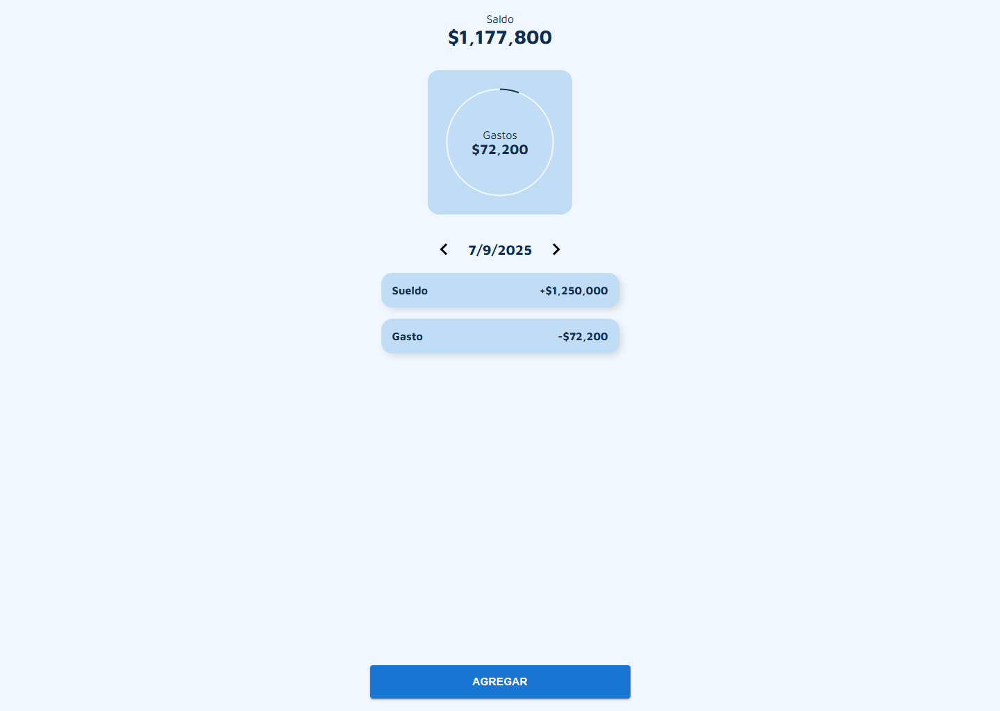
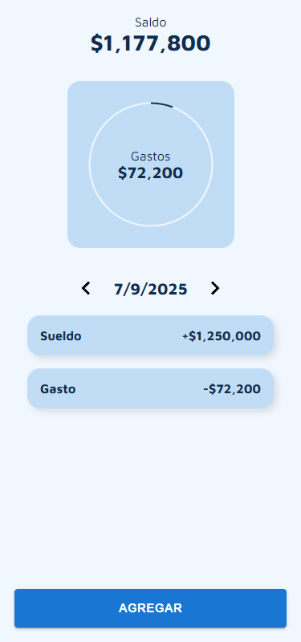

# Control de gastos MERN

Aplicación ideal para controlar gastos personales. Podés agregar,
editar, eliminar y leer ingresos y egresos.

## Features

- Validación de formularios
- Animaciones dinámicas
- Logueo y registro de usuarios
- Adaptado a mobile!

## Tech Stack

**Client:** React, Redux, React router dom, MaterialUI.

**Server:** Node, Express, MongoDB, zod.

## Screenshots

## Demo

https://control-de-gastos-mern.netlify.app/

## Authors

- [@arielnicolas2021](https://www.github.com/arielnicolas2021)